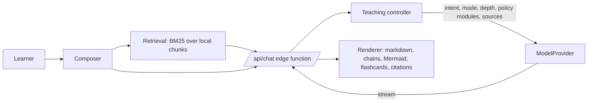

# Architecture

## Request flow



1. **Composer** collects the message, attachments, pinned page and settings (mode, depth, knowledge mode, policy toggles).
2. **Retrieval** (browser) searches the learner's chunks and sends the top passages with tags `S1…Sn`, document names and page numbers. Only these passages leave the device.
3. **Teaching controller** (`ai/teacher/controller.js`) detects intent (spec §78), resolves mode and depth, assembles the system prompt from small policy modules (`ai/teacher/modules.js`), sets a token budget, and enforces **source-locked** mode (refuses with a fixed message when My Library has no support).
4. **ModelProvider** (`ai/providers/`) exposes `generate`/`stream` for Anthropic, OpenAI-compatible APIs and a demo provider. Adding a provider means one file.
5. **Renderer** (`frontend/js/render.js`) sanitises output (DOMPurify), renders ```` ```chain ````, ```` ```flashcards ````, ```` ```mermaid ```` and `> [!HIGHYIELD]`-style callouts, validates and repairs Mermaid, and links `[S#]` to the PDF viewer.

## Teaching layers

Problem → simplest picture → mechanism (causal chain) → timeline → patient → investigations → treatment → differentials → Step 1 reasoning (fact / why true / distractor / why wrong) → active recall → flashcards. Layers are included according to depth and the toggles in Settings.

## Storage

| Phase 1 (now) | Phase 2+ |
|---|---|
| IndexedDB stores: chats, messages, documents, files, chunks, flashcards | PostgreSQL tables in `database/schema.sql` |
| BM25 retrieval in the browser | pgvector hybrid search (`match_chunks`) |
| Settings in localStorage | `users.settings` jsonb |

The retrieval interface (`search(query, {docIds, k, pinned})`) is the same in both phases, so the chat code does not change.

## Roadmap

- **Phase 1 (this release)**: teaching engine, library + viewer, citations, source-locked mode, flashcards, responsive UI.
- **Phase 2**: accounts + Postgres sync, question bank (tutor/timed modes, distractor analysis, error taxonomy), progress dashboard, OCR for scanned PDFs, embeddings.
- **Phase 3**: knowledge graph and prerequisite engine, study plans from exam date.
- **Phase 4**: specialised agents (examiner, case simulator), source comparison mode.
- **Phase 5**: collaboration, institutional libraries, offline PWA.
