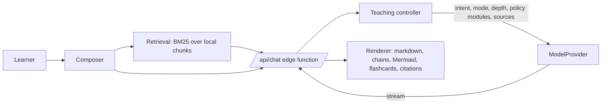

# Architecture

## Request flow



1. **Composer** collects the message, attachments, pinned page and settings (mode, depth, knowledge mode, policy toggles).
2. **Retrieval** (browser) searches the learner's chunks and sends the top passages with tags `S1…Sn`, document names and page numbers. Only these passages leave the device.
3. **Teaching controller** (`ai/teacher/controller.js`) detects intent (spec §78), resolves mode and depth, assembles the system prompt from small policy modules (`ai/teacher/modules.js`), sets a token budget, and enforces **source-locked** mode (refuses with a fixed message when My Library has no support).
4. **ModelProvider** (`ai/providers/`) exposes `generate`/`stream` for Anthropic, OpenAI-compatible APIs and a demo provider. Adding a provider means one file.
5. **Renderer** (`frontend/js/render.js`) sanitises output (DOMPurify), renders ```` ```chain ````, ```` ```flashcards ````, ```` ```mermaid ```` and `> [!HIGHYIELD]`-style callouts, validates and repairs Mermaid, and links `[S#]` to the PDF viewer.

## Teaching layers

Problem → simplest picture → mechanism (causal chain) → timeline → patient → investigations → treatment → differentials → Step 1 reasoning (fact / why true / distractor / why wrong) → active recall → flashcards. Layers are included according to depth and the toggles in Settings.

## Phase 2 learning loop

```
lesson ──(hidden concepts block)──▶ knowledge graph ◀── questions / flashcards (concept links)
   ▲                                      │
   │ prerequisite plan (teach/review/skip)│ prerequisites()
   │                                      ▼
 chat request ◀──────── learner model (understanding · recall · application per concept)
                                          ▲
      lesson self-rating ─────────────────┤
      flashcard review (FSRS grade) ──────┤
      question attempt + confidence ──────┤
      error classification (8 types) ─────┘
                                          │
                                          ▼
                 progress dashboard · weakness map · bottlenecks · study plan
```

- `frontend/js/graph.js`: seed parsing, phrase matching (longest alias wins), prerequisite chains (foundations first, cycle-safe), dependents, merging lesson blocks.
- `frontend/js/learner-model.js`: pure evidence rules. Recent evidence is weighted more (the last ~8 events dominate). A confidently wrong answer also lowers understanding; a lucky guess counts as weaker evidence than a sure answer.
- `frontend/js/srs.js`: FSRS v4.5 parameters at 90 % target retention; Phase 1 SM-2 cards are migrated on first review.
- `api/generate.js` + `ai/tasks/questions.js`: the model writes strict JSON; it is streamed through (no edge time-out) and `frontend/js/question-parse.js` salvages complete items from truncated output, validates them (5 options, one correct) and shuffles options.
- `frontend/js/study-plan.js`: phases, need-weighted system rotation and daily/weekly targets, recomputed on every visit.

## Storage

| Browser (now) | Server (later) |
|---|---|
| IndexedDB v2 stores: chats, messages, documents, files, chunks, flashcards, questions, blocks, attempts, mastery, graph, reviews (v1 databases upgrade automatically) | PostgreSQL tables in `database/schema.sql` + `migrations/002_phase2.sql` |
| BM25 retrieval in the browser | pgvector hybrid search (`match_chunks`) |
| Settings in localStorage | `users.settings` jsonb |

The retrieval interface (`search(query, {docIds, k, pinned})`) is the same in both phases, so the chat code does not change.

## Roadmap (spec §71–75)

- **Phase 1 (done)**: teaching engine, library + PDF viewer, RAG with page citations, source-locked mode, image upload, responsive Claude-like UI.
- **Phase 2 (done)**: knowledge graph, prerequisite engine, question engine, error analysis, flashcards, FSRS spaced repetition, learner model, progress dashboard, weakness map, study plan.
- **Phase 3 (done)**: image understanding (ECG, radiology, histology, pathology, clinical photos) with systematic reading and image practice, interactive diagrams and chains, whiteboard with AI feedback.
- **Phase 4**: local/open-weight model, fine-tuning, medical instruction and SmartMedicine behavioural tuning, evaluation, quantisation, local inference.
- **Phase 5**: personalised curriculum, adaptive question selection, predictive knowledge-gap detection, advanced spaced repetition, cross-topic reasoning, longitudinal learner model (Phase 2 already lays groundwork: weak-area blocks, bottleneck detection, FSRS).

The Phase 1 items that were deferred (§71 authentication and vector search) are done: optional accounts with local-first sync (`api/auth.js`, `api/sync.js`, `frontend/js/sync.js`), and in-browser embeddings fused with BM25 (`frontend/js/embeddings.js`, `retrieval.js`).

## Offline storage design

`frontend/js/workbook-core.js` is a pure mapping between the IndexedDB stores and an Excel workbook (readable columns + JSON `Record` columns split at 32,000 characters). `local-files.js` adds targets: a manual download/restore, the File System Access API (a folder on a desktop), or `PUT /api/local-store` in local mode. Auto-save is debounced 15 s after any change and on tab hide; originals (PDFs/images) are copied once each into `files/` rather than into the workbook. `local/server.mjs` writes atomically (temp file + rename), keeps hourly rotating backups, and binds to 127.0.0.1. On start-up, if the browser has no data but a target does, the workbook is imported automatically, which is what makes "clear your browser and carry on" work.

## Sync design

Every synced IndexedDB write stamps the record with `_u` (time) and, in the same transaction, records `store:id` in an `outbox`. `sync.js` pushes the outbox in ≤2.5 MB batches to `/api/sync`, which upserts into `sync_records` only when the incoming `_u` is newer (last write wins) and returns rows with a higher per-user sequence number than the device's cursor. Remote rows are applied without re-queueing. Raw files, embedding vectors and full-size chat images stay on the device. On sign-in a device that holds another account's data is wiped first; data created before signing in is adopted into the account.
